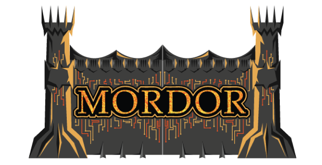

# Mordor 😈

The Mordor project provides pre-recorded security events generated after simulating adversarial techniques in the form of JavaScript Object Notation (JSON) files for easy consumption and Packet Capture (PCAP) files as additional context when applicable. The pre-recorded data is categorized by platforms, adversary groups, tactics and techniques defined by the MITRE [ATT&CK Framework](https://attack.mitre.org/wiki/Main_Page). The pre-recorded data represents not only specific known malicious events but additional context/events that occur around it. This is done on purpose so that you can test creative correlations across diverse data sources, enhancing your detection strategy and potentially reducing the number of false positives in your own environment.

The name **Mordor** comes from the awesome book/film series "[The Lord of the Rings](https://en.wikipedia.org/wiki/The_Lord_of_the_Rings_(film_series))", and it was a place where the evil forces of [Sauron](https://en.wikipedia.org/wiki/Sauron) lived. This repository is where data generated by known "malicious" adversarial activity lives, hence the name of the project.

# Docs

* https://mordordatasets.com

# Goals

* Provide open portable malicious datasets to expedite the development of data analytics. 
* Facilitate and expedite adversay techniques simulation and output consumption.
* Allow security analysts around the world to test their skills with real known bad data.
* Improve the testing and validation of detection analytics in an easier, practical, modular and more affordable way. 
* Enable data scientists to have semi-labeled data for initial research and features development.
* Map datasets to other open source projects such as Sigma, Atomic Red Team, Threat Hunter Playbook (Jupyter Notebooks) and MITRE CAR analytics
* Contribute to the [ATT&CK framework](https://attack.mitre.org/wiki/Main_Page) framework and provide real-world data samples during the creation and validation of data sources.
* Provide datasets for other social/community events such as Capture The Flags (CTFs) or hackathons to encourage collaboration.

# Projects Using Mordor

* [ThreatHunter-Playbook](https://github.com/Cyb3rWard0g/ThreatHunter-Playbook)
* [HELK](https://github.com/Cyb3rWard0g/HELK)

# Authors

* Roberto Rodriguez [@Cyb3rWard0g](https://twitter.com/Cyb3rWard0g)
* Jose Luis Rodriguez [@Cyb3rPandaH](https://twitter.com/Cyb3rPandaH)

# Contributing

Help us build the largest library of datasets for the InfoSec community!. Learn more about how you could do it [here](https://mordordatasets.com/create/intro.html)! 

# License: GPL-3.0

[ Mordor's GNU General Public License](https://github.com/Cyb3rWard0g/Mordor/blob/master/LICENSE)